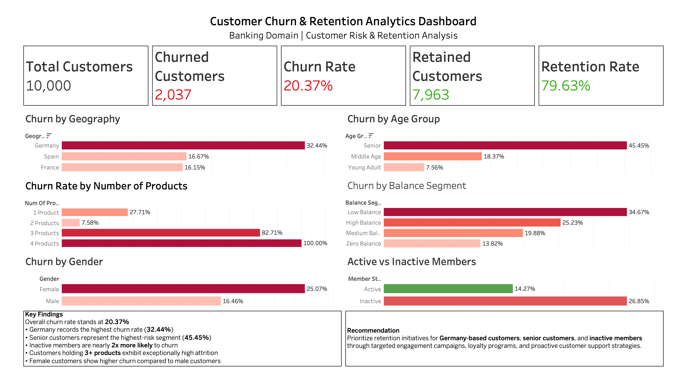
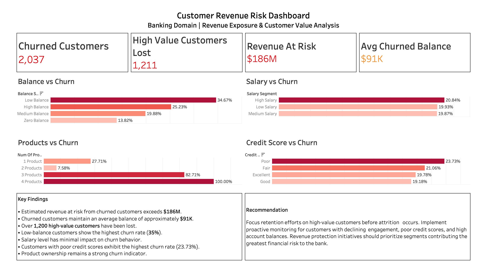
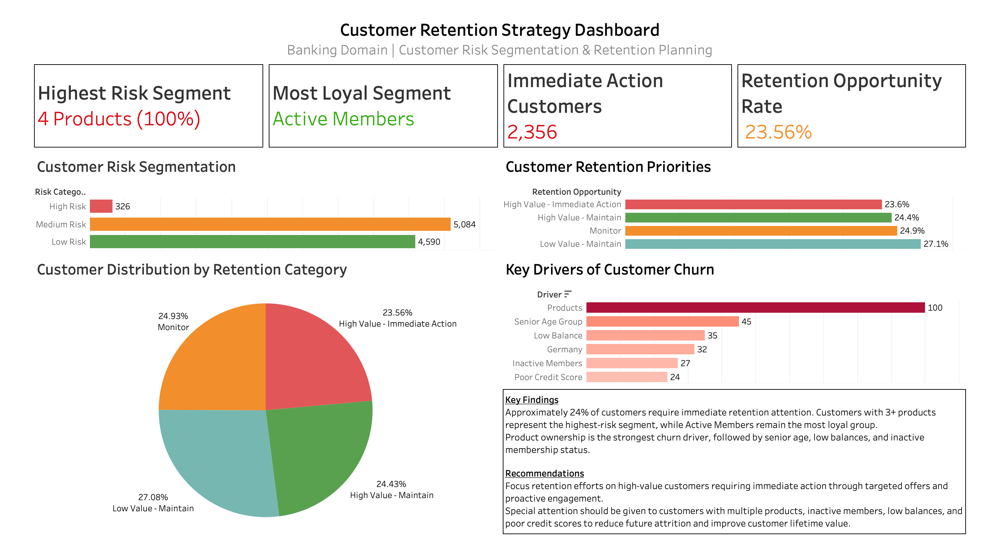

# 🏦 Customer Churn Analysis & Retention Strategy Dashboard
An end-to-end data analytics project built using SQL, Microsoft Excel, and Tableau to identify customer churn patterns, quantify revenue exposure, and develop data-driven retention strategies.

The project analyzes a banking customer dataset containing 10,000 customer records and transforms raw customer information into actionable business insights through KPI development, risk segmentation, churn analysis, and executive dashboards.

Key Outcomes

* Identified customer segments with the highest churn risk.
* Quantified revenue exposure from customer attrition.
* Ranked major churn drivers affecting customer retention.
* Developed retention opportunity categories for targeted intervention.
* Designed executive dashboards for strategic decision-making.
### Interactive Dashboard

Tableau Public Dashboard:  
[View Interactive Tableau Dashboard] (https://public.tableau.com/views/CustomerChurnAnalysisRevenueRiskRetentionStrategyDashboard/CustomerChurnOverview?:language=en-US&:sid=&:redirect=auth&:display_count=n&:origin=viz_share_link)

---

# 📌 Project Overview

This project presents an end-to-end Customer Churn Analytics solution developed using SQL, Microsoft Excel, and Tableau Public for a Banking Customer Churn dataset.

The project follows a complete analytics workflow including data cleaning, SQL-based business analysis, KPI development, customer segmentation, revenue risk assessment, and dashboard creation to generate actionable business insights.

The final solution consists of three executive-level dashboards designed to analyze customer attrition, quantify revenue risk, identify churn drivers, and recommend data-driven retention strategies.

---

# 🎯 Business Problem

Customer churn is one of the most significant challenges faced by banks and financial institutions. Losing customers not only reduces revenue but also increases customer acquisition costs and impacts long-term profitability.

Without proper analysis, identifying high-risk customer segments, understanding churn drivers, and prioritizing retention efforts becomes difficult.

This project aims to transform raw customer data into actionable business insights through interactive dashboards that support strategic decision-making and customer retention planning.

---

# 🔄 Analytics Workflow

1. Data Collection (Bank Customer Churn Dataset)

2. Data Cleaning and Validation in Excel

3. Business Analysis using SQL

4. KPI Development

5. Dashboard Design in Tableau

6. Customer Segmentation

7. Revenue Risk Assessment

8. Business Insight Generation

9. Executive Reporting

---

# 🛠️ Tools & Technologies

- SQL (MySQL)
- Tableau Public
- Microsoft Excel
- Data Cleaning
- Data Visualization
- Customer Segmentation
- Business Analytics
- Dashboard Design
- KPI Development
- Calculated Fields

---

# 📊 Excel Tasks Performed

- Data Validation
- Duplicate Checking
- Data Formatting
- Missing Value Inspection
- Data Quality Verification
- Dataset Preparation for Analysis

---

# 🗄️ SQL Concepts Used

- Aggregations (COUNT, SUM, AVG, ROUND)
- GROUP BY & ORDER BY
- CASE Statements
- Customer Segmentation
- Churn Analysis
- Retention Analysis
- Revenue Risk Assessment
- Business Performance Analysis

---

# 📊 Dashboards Included

## Customer Churn Overview Dashboard

Provides a high-level overview of customer attrition patterns and customer demographics.

### Key Metrics

- Total Customers
- Churned Customers
- Retained Customers
- Churn Rate

### Visualizations

- Churn by Geography
- Churn by Gender
- Churn by Membership Status
- Churn by Balance Segment

---

## Customer Revenue Risk Dashboard

Measures the financial impact of customer churn and identifies revenue exposure.

### Key Metrics

- Revenue At Risk
- High Value Customers Lost
- Average Churned Balance
- Churned Customers

### Visualizations

- Balance vs Churn
- Salary vs Churn
- Products vs Churn
- Credit Score vs Churn

---

## Customer Retention Strategy Dashboard

Provides actionable retention planning insights and customer prioritization.

### Key Metrics

- Highest Risk Segment
- Most Loyal Segment
- Immediate Action Customers
- Retention Opportunity Rate

### Visualizations

- Customer Risk Segmentation
- Customer Retention Priorities
- Customer Distribution by Retention Category
- Key Drivers of Customer Churn

---

# 📈 Key Business Insights

## Customer Churn Insights

- Overall customer churn rate was identified as 20.37%.
- A total of 2,037 customers were lost from the customer base.
- Approximately 79.63% of customers were retained.

---

## Revenue Risk Insights

- Customer churn exposed the bank to approximately $186 Million in revenue risk.
- More than 1,200 high-value customers were lost.
- Churned customers maintained an average account balance of approximately $91K.

---

## Customer Risk Insights

- Customers holding 4 products exhibited the highest churn rate (100%).
- Customers with 3 products demonstrated extremely high churn behavior (82.71%).
- Product ownership emerged as the strongest churn driver.

---

## Customer Behavior Insights

- Active Members represented the most loyal customer segment.
- Inactive customers were significantly more likely to churn.
- Senior customers exhibited the highest age-based churn risk.

---

## Retention Insights

- Approximately 23.56% of customers require immediate retention attention.
- High-value customers account for a significant share of retention opportunities.
- Product ownership, inactivity, balance level, and credit score are key churn indicators.

---

# 📷 Dashboard Screenshots

## Customer Churn Overview Dashboard

---

## Customer Revenue Risk Dashboard

---

## Customer Retention Strategy Dashboard

---

# 🔗 Tableau Public Dashboard

[View Interactive Tableau Dashboard]

(https://public.tableau.com/views/CustomerChurnAnalysisRevenueRiskRetentionStrategyDashboard/CustomerChurnOverview?:language=en-US&:sid=&:redirect=auth&:display_count=n&:origin=viz_share_link)

---

# 📁 Dataset

### Bank Customer Churn Dataset

The dataset contains customer information including:

- Customer ID
- Credit Score
- Geography
- Gender
- Age
- Tenure
- Balance
- Number of Products
- Credit Card Ownership
- Activity Status
- Estimated Salary
- Churn Status

---

# 💡 Business Value

This analytics solution enables stakeholders to:

- Monitor customer churn trends.
- Quantify revenue exposure from customer attrition.
- Identify high-risk customer segments.
- Prioritize retention efforts.
- Understand key churn drivers.
- Improve customer engagement strategies.
- Support data-driven business decisions.
- Enhance long-term customer retention.

---

## 💡 Business Impact

This solution enables banking stakeholders to:

- Reduce customer attrition through targeted retention strategies.
- Prioritize high-value customers requiring immediate intervention.
- Quantify revenue at risk from churned customers.
- Identify the strongest drivers influencing customer churn.
- Improve customer lifetime value through proactive engagement.
- Support executive decision-making using KPI-driven dashboards.

---

# 👨‍💻 Author

## Aryan Chechi

Computer Engineering Undergraduate | Data Analytics Enthusiast

### Skills

- SQL
- Tableau
- Excel
- Data Analytics
- Business Intelligence
- Data Visualization

### LinkedIn

https://www.linkedin.com/in/aryanchechi

### Tableau Public

https://public.tableau.com/app/profile/aryan.chechi
